# Diagramas del Sistema - Sermaluc Gestión de Servicios

## Diagrama de Arquitectura General

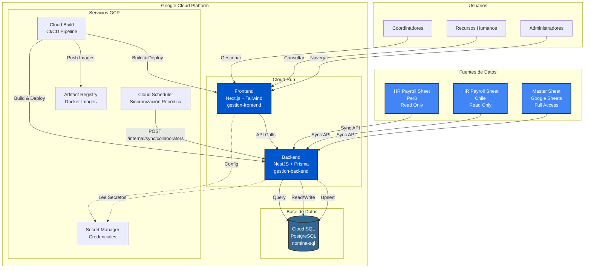

## Flujo de Sincronización de Datos

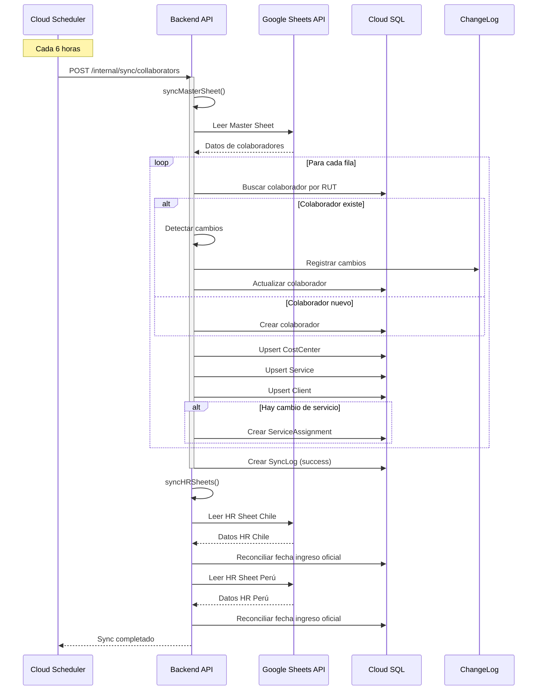

## Arquitectura de Base de Datos

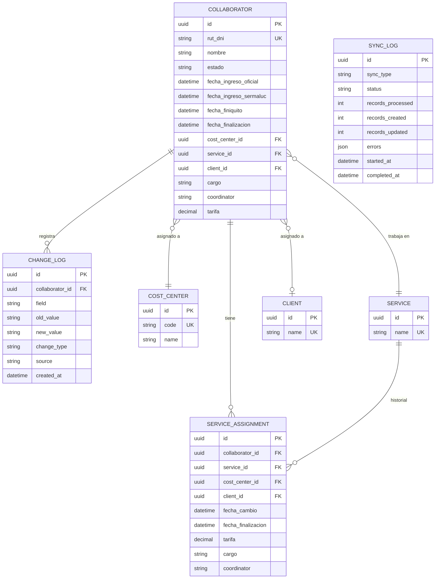

## Flujo de Usuario - Gestión de Colaboradores

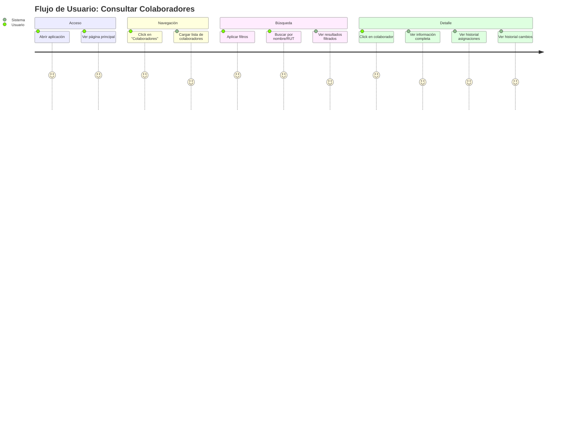

## Pipeline CI/CD

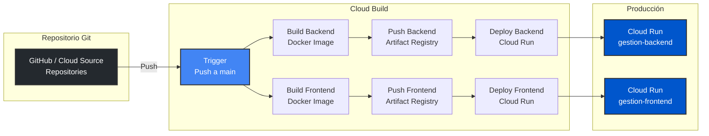

## Proceso de Negocio - Gestión de Colaboradores

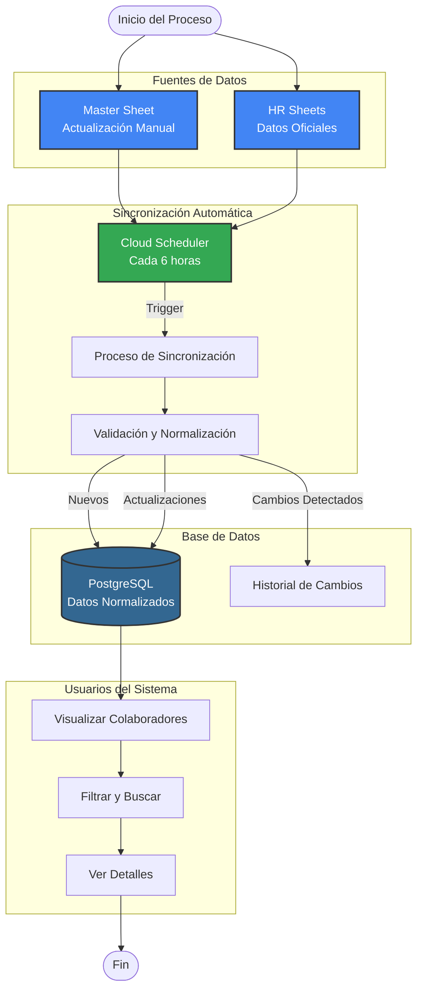

## Arquitectura de Componentes - Backend

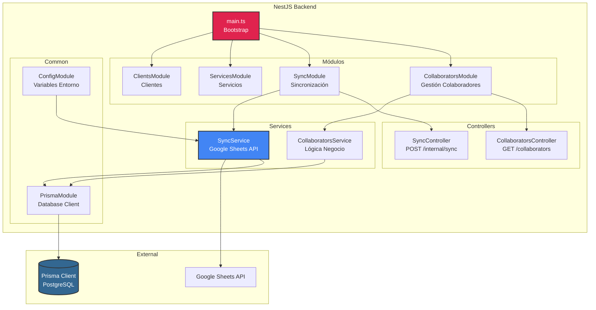

## Arquitectura de Componentes - Frontend

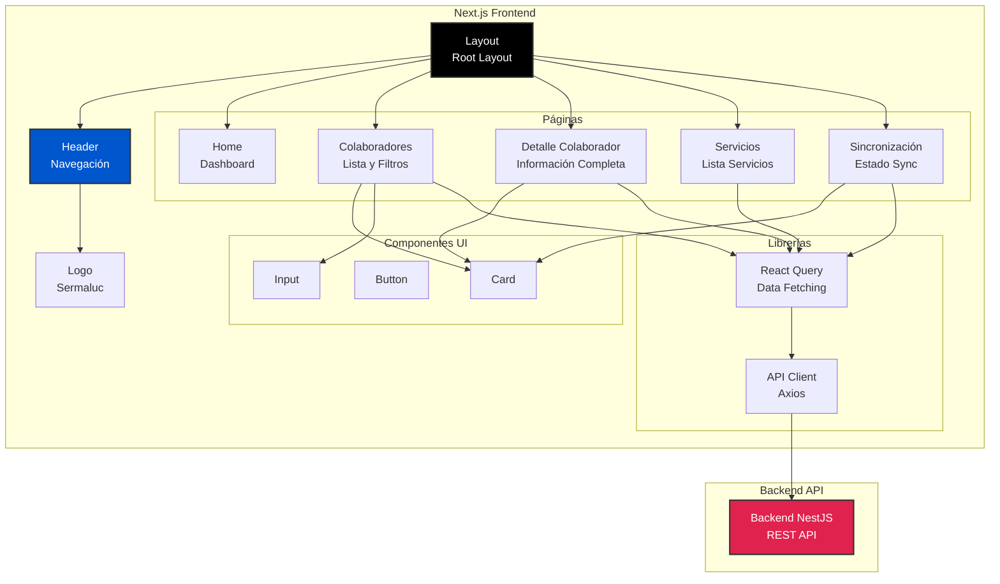

## Flujo de Datos - Sincronización Completa

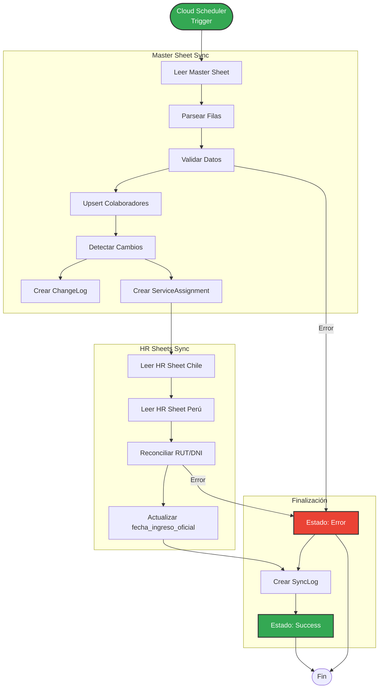

## Modelo de Datos - Relaciones Principales

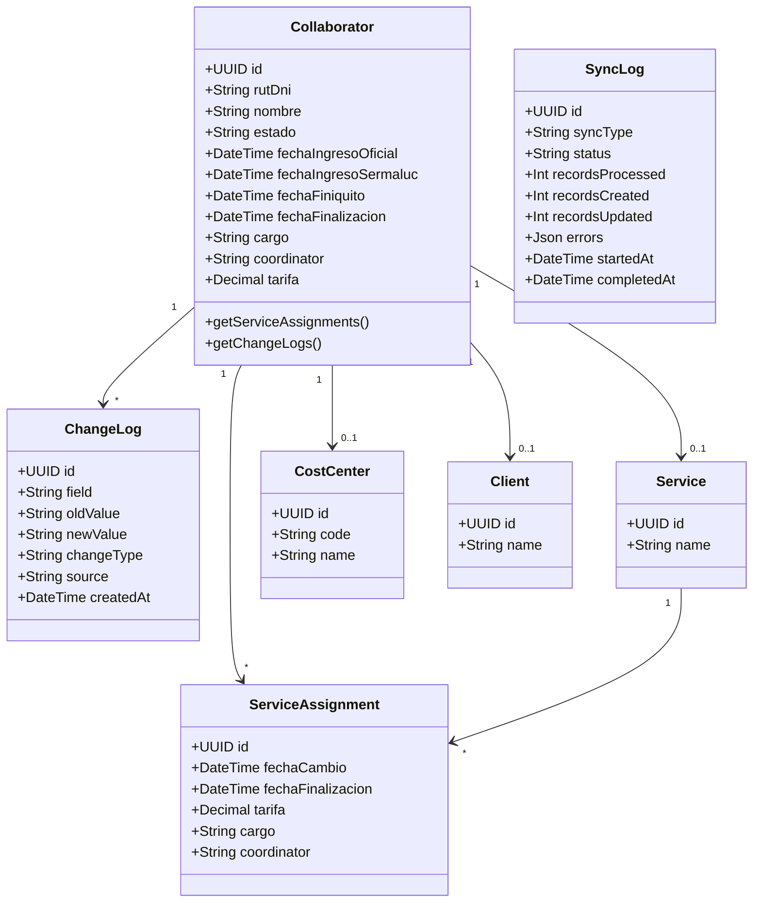

## Seguridad y Accesos

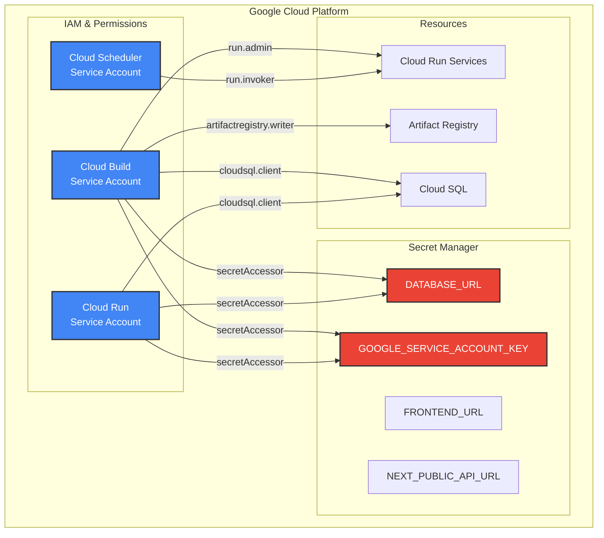

